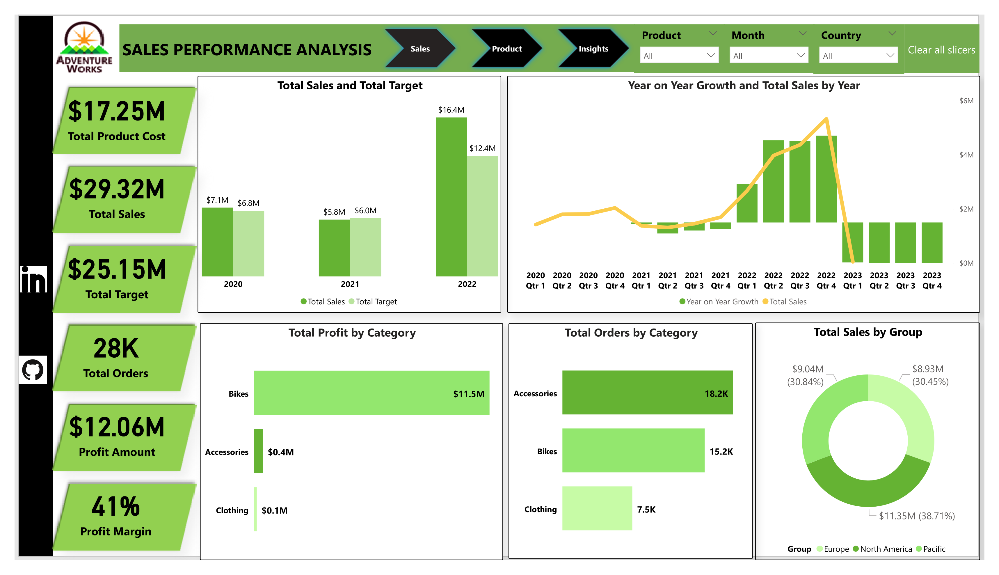
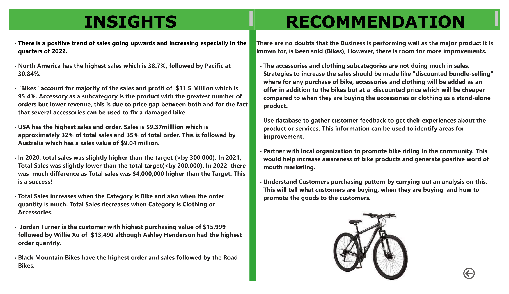
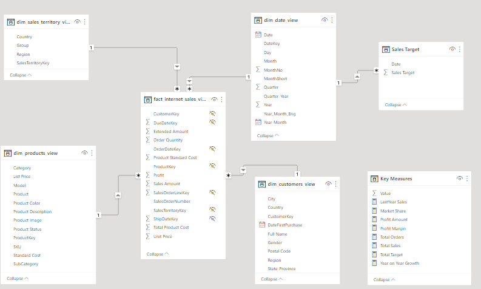

# JanuaryClass
This is an Exploratory Data Analysis of a Sales Data from January 2022-December 2023

## Introduction

This is an Analysis to optimise inventory management for FitCapacity company by analyzing sales and inventory data using SQL and PowerBI. (The Warehouse picture below is gotten from google

---

 

 [here](https://docs.github.com/en)

 ## Problem Statement
 
 The goal of the analysis is to:

- identify which products have the highest turnover rate and which have the lowest turnover rate.
- identify the average time a product is out of stock and the frequency of stockouts.
- classify products into high-selling, low-selling and average-selling.
- use the insights gained to make recommendations for how to optimize inventory levels and minimize stockouts which may include adjustments to reorder points, ordering certain products, or discontinuing products that are not selling well.

## Skills and Concepts demonstrated:

SQL (Select, alias, Views)
- PowerBI concepts like:
- creating columns for calculations for dates, time, and duration
Creating key performance indicators (KPIs) and other business calculations,
Developing general DAX calculations that deal with text and numbers,
Performed advanced DAX calculations for solving statistical measures and other mathematical formulas
Data Modelling,
Measures,
Navigation panes,
filters,
tooltips,
buttons,
bookmarks,
Data Visualization

## Data Modelling:

The intelligence in PowerBI makes it such that tables are automatically joined by creating relationships with them. However, as someone who understands the dataset and wants to get specific insights and information. I had to create other relationships and measures to enable me. so I did another model. I created 7 dimension tables and 2 fact tables as I hoped for a Star Schema.

AutomatedModel                      |            CreatedModel
:---------------------------------: | :-----------------------------------:
             | 

## Limitation

tyeu yuyguilhliuhsiuhufilhuihfihaiuhihafhioruoiuaoiufo;a;roifdfrgrgbst   😄

🧑‍🎤

